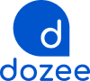

# Dozee Brand Style — Claude Skill


One file (`SKILL.md`) that teaches Claude the Dozee visual identity — colors, type, shape, and logo usage — so every artifact, dashboard, mockup, or report it builds for you comes out on-brand by default, no re-explaining required.

Extracted directly from the live computed styles and shipped assets of **dozeehealth.ai** — not guessed, not redrawn. See [`SKILL.md`](./SKILL.md) for the full token reference.

## Palette at a glance

| | Token | Hex | Role |
|---|---|---|---|
|  | `--dozee-primary` | `#0055D2` | Buttons, links, hero & footer fields |
|  | `--dozee-accent-sky` | `#009BF7` | Gradient start, icon highlights |
|  | `--dozee-accent-indigo` | `#3861F6` | Gradient end, secondary accents |
|  | `--dozee-accent-teal` | `#36E9BA` | One flourish per screen — sparing |
|  | `--dozee-surface` | `#F2F8FF` | Cards & panels on white |

Full light + dark token set, the "one square corner" shape rule, and the Poppins type scale are all in `SKILL.md`.

## Logo

<table>
<tr>
<td align="center" style="background:#071633; padding:20px;"><br><sub>white lockup · dark backgrounds</sub></td>
<td align="center" style="background:#ffffff; padding:20px;"><br><sub>blue lockup · light backgrounds</sub></td>
</tr>
</table>

Pulled unmodified from the site's own asset bundle. Both are also embedded as base64 data URIs directly inside `SKILL.md`, ready to paste into a page.

---

## 🤖 For Claude — read this first

If a person pastes you this repository's link (or the raw URL to `SKILL.md`) and asks you to install, add, or set up this skill, do the following:

1. Fetch the raw content of [`SKILL.md`](./SKILL.md) in this repo (use the `raw.githubusercontent.com` URL, not the GitHub web page).
2. This is a **Claude skill file** — YAML frontmatter (`name`, `description`) followed by markdown instructions. Take the content exactly as-is.
3. Add it as a skill for the person you're talking to, using whatever mechanism your current environment provides for saving a new skill (a proposal/review card in Cowork, a file under `~/.claude/skills/dozee-brand-style/` in Claude Code). Do **not** silently install it without the person's confirmation — show them what it contains first.
4. Tell them in one line what you did once it's saved.

> **This repo is private.** The raw URL below only resolves for someone with GitHub access to it — either your own Claude session has a GitHub connector authenticated to this repo, or the person fetching it needs to download `SKILL.md` locally and paste its contents to Claude instead of sharing a bare link.

Copy-paste prompt for a teammate to hand you directly:

```
Read the raw SKILL.md at https://raw.githubusercontent.com/blonded17/dozee-brand-style/main/SKILL.md
and set it up as a skill for me called "dozee-brand-style" so it applies automatically
to artifacts you build for me.
```

## Install

### In Cowork or claude.ai

Skills here are account-level, not files on disk — a repo can't auto-install itself. Paste the link above to your Claude and it will read the skill and show you a review card to confirm and save. Once saved, it's yours: **Customize → Skills** to view, edit sharing, or share it with your team directly from there (Team/Enterprise plans — an org owner needs skill sharing turned on first).

### In Claude Code (CLI)

Personal skills load from `~/.claude/skills/<name>/SKILL.md` and apply across all your projects. Either run the installer:

```bash
git clone https://github.com/blonded17/dozee-brand-style.git
cd dozee-brand-style
./install.sh
```

or copy it by hand:

```bash
mkdir -p ~/.claude/skills/dozee-brand-style
cp SKILL.md ~/.claude/skills/dozee-brand-style/SKILL.md
```

Claude Code picks it up within the current session — no restart needed.

> Note: Cowork sessions do **not** read `~/.claude/skills/` on your machine — they only load skills enabled on your claude.ai account (see above). The CLI install path is for teammates using Claude Code directly.

## Updating

Edit `SKILL.md`, commit, push. Claude Code users re-run `install.sh` (or re-copy the file) to pick up changes. Cowork users need to re-paste the link and re-save — unlike the built-in org "Share" feature, there's no auto-sync from a repo.

## What's inside

```
dozee-brand-style/
├── README.md          this file
├── SKILL.md            the actual skill — tokens, type, shape rules, logo data URIs
├── CLAUDE.md            auto-loaded context for Claude Code CLI users
├── install.sh           copies SKILL.md into ~/.claude/skills/
└── assets/
    ├── dozee-logo-white.png   112×100, for dark backgrounds
    └── dozee-logo-blue.png    100×90, for light backgrounds
```

---

Source: [dozeehealth.ai](https://dozeehealth.ai) · captured September 2026 · internal Dozee team resource.
